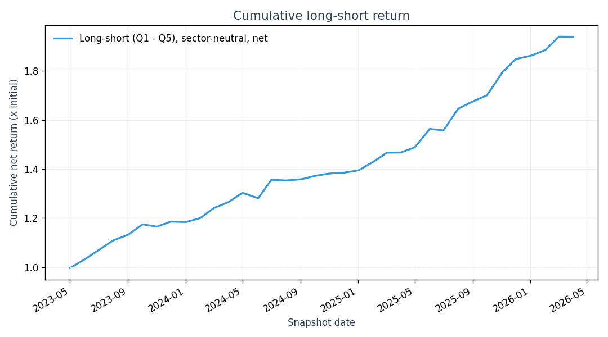
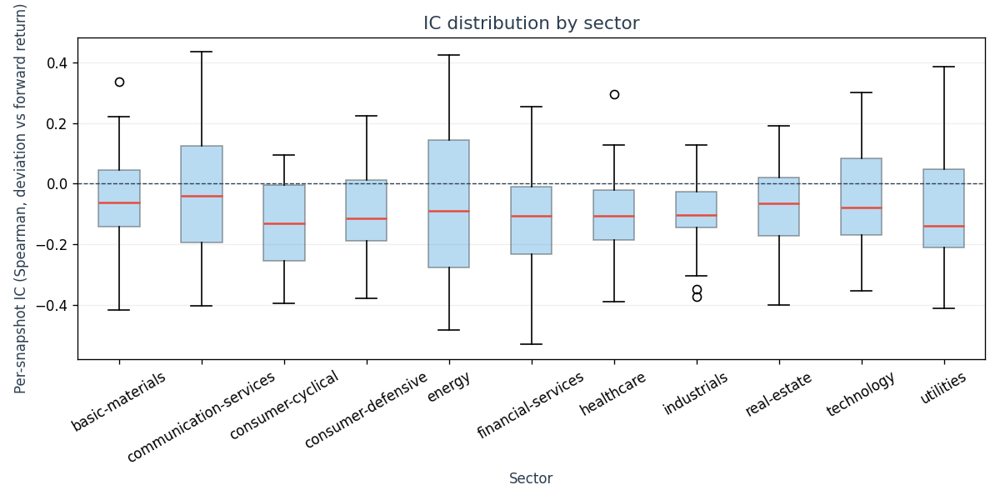

# Backtest

An empirical test of whether the per-ticker deviation signal produced by the sector-relative valuation model (see `STRATEGY.md`) predicts forward stock returns. This is a Phase 3 deliverable; the headline numbers below should be read alongside §2 ("Methodology limitations") before being interpreted as evidence of a tradable signal.

Headline (36-month run, 10 bps round-trip cost):

| Metric                    | Value    |
| ------------------------- | -------- |
| Mean Spearman IC          | -0.0799  |
| IC t-stat                 | -8.85    |
| IC information ratio      | -2.98    |
| LS annualized Sharpe      |  3.36    |
| LS cumulative return      |  93.96%  |
| LS max drawdown           |  -1.72%  |
| LS hit rate (months > 0)  |  80.56%  |

A negative IC is the "signal works" direction: more-negative deviation (a ticker priced cheaper than the within-sector model predicts) is correlated with a higher subsequent monthly return. The IR and Sharpe magnitudes are implausibly strong for a real free-tier-data signal and are almost certainly inflated by the methodology limitations documented in §2 — primarily look-ahead bias in the fundamentals. Read §5 before drawing any conclusion.

## 1. Methodology

### Universe and snapshot schedule

- **Universe:** the 795 tickers carried by `sector_analysis.csv` after the within-sector outlier filter described in `STRATEGY.md` §3-4. This is sourced from `data/russell1000.csv` (the current Russell 1000 constituent list) by way of the `src/data.py` pipeline. The universe is fixed across the backtest window — every snapshot evaluates the same tickers (with per-snapshot per-sector survival requirements; see "Portfolio construction" below).
- **Sample window:** trailing 36 calendar months ending at the most recent available trading day (configurable via `--months`).
- **Snapshot frequency:** monthly. Each snapshot is the first available trading day on or after a calendar month-start. The last usable snapshot is constrained so that its t+1 month forward date is still inside the fetched price index — we need both ends to compute a forward return.

### Signal construction

At each snapshot date `t`, for each surviving ticker `i`:

1. **Trailing PE at `t`** is computed as `actual_PE_t = price_t / current_TTM_EPS_i`, where:
   - `price_t` is the split- and dividend-adjusted close on date `t` from `yfinance.history` (PIT-correct — see §2.1).
   - `current_TTM_EPS_i = last_price_i / current_PE_i` from `sector_analysis.csv`, computed once and reused at every snapshot. This is the look-ahead-affected EPS proxy: at `t = 2023-05`, we are using EPS derived from today's price and today's reported trailing P/E, not the actual TTM EPS as of May 2023.
2. **Within-sector OLS fit** of `pe_t` on `composite_z_score` is refit at each snapshot (`np.polyfit(x, y, 1)`), matching the same fit the dashboard performs (`src/dashboard.py:500`). The composite z-score and the per-sector Ridge weights baked into it are *current values from `sector_analysis.csv`* — they do not change across snapshots, although the per-snapshot OLS slope and intercept do (because `pe_t` does).
3. **Predicted PE at `t`:** `predicted_PE_t = slope_t · composite_z_score_i + intercept_t`.
4. **Deviation:** `deviation_t_i = actual_PE_t_i - predicted_PE_t_i`. A negative deviation indicates the ticker trades at a lower trailing P/E than its sector-relative composite z-score would predict ("cheap"); a positive deviation indicates the opposite ("rich").

### Portfolio construction

Within each sector at each snapshot:

- Surviving tickers (positive `pe_t`, non-null `composite_z_score`, valid t and t+1mo prices) are ranked by `deviation`.
- Quintile buckets (`pandas.qcut`, `_N_QUINTILES = 5`, `duplicates='drop'`) are formed.
- **Long leg:** Q1 (most-negative deviation). **Short leg:** Q5 (most-positive deviation).
- Equal-weighted within each leg.
- Sectors with fewer than 15 surviving tickers at a snapshot are skipped (the quintile arithmetic is not meaningful with 2-3 names per bucket).

Across sectors at each snapshot:

- The per-sector `(long_mean - short_mean)` is computed.
- The cross-sector aggregate is the **equal-weighted average across the per-sector LS returns** — sector-neutral. The model is sector-relative by construction (§STRATEGY.md §1); market-cap- or size-weighting across sectors would let one sector's signal dominate the aggregate.

### Forward returns

For each ticker in each portfolio: `fwd_return_i = (price_{t+1mo} - price_t) / price_t`, where both prices come from the PIT-correct adjusted-close series. Tickers without a t+1mo price (delisted, suspended, etc., between rebalances) are dropped from that snapshot's portfolio; this is the only survivorship-handling done within the backtest itself.

### Transaction costs

A flat round-trip cost in basis points is deducted from each month's long-short return. Default `--cost-bps=10` (5 bps each side). The strategy is treated as fully turning over each month — a conservative assumption, since in practice some names persist across rebalances. Tracking actual name-level turnover would meaningfully tighten this; see §6.

### Metrics

- **IC** is the per-sector per-snapshot Spearman rank correlation between `deviation` and `fwd_return`. **Mean IC** averages across all (sector, snapshot) pairs. **IC t-stat** = `mean_IC / (std_IC / sqrt(N))` over the same population. **IC information ratio** = `mean / std × √12` computed on the per-snapshot cross-sector mean IC series (Grinold convention).
- **Long-short Sharpe (annualized)** = `mean / std × √12` of the monthly net long-short return series.
- **Cumulative return** = `cumprod(1 + net_monthly_return) - 1` over the window.
- **Max drawdown** = `min(cum / cum.cummax() - 1)`.
- **Hit rate** = `(net_monthly_return > 0).mean()`.

### Reproducibility

```sh
uv run python src/backtest.py --months 36 --cost-bps 10
```

Outputs: `backtest_results.csv` (one row per (snapshot, sector)), `backtest_artifacts/cumulative_long_short_return.png`, `backtest_artifacts/ic_distribution_by_sector.png`. The yfinance price cache lives at `backtest_cache/prices.pkl` (gitignored; regenerable).

## 2. Methodology limitations

These are the constraints the free-tier data forces on the design. They should be read before §3 and §5; the headline numbers will be misleading otherwise.

### 2.1 Fundamentals are not point-in-time (LOOK-AHEAD BIAS)

The composite z-score (`composite_z_score`), the per-sector Ridge weights, and the per-ticker trailing P/E that feed `sector_analysis.csv` are all *as of the latest data refresh*. There is no historical-fundamentals series available from yfinance's free tier. When the backtest forms the signal at `t = 2023-05` it uses:

- the composite z-score *as of today* (which encodes today's revenue growth, today's RSI, today's drawdown, today's debt-to-equity, today's log market cap), not the composite z-score that would have been observable in May 2023; and
- a per-ticker EPS proxy derived from *today's* price-divided-by-today's-PE, not the actual TTM EPS as it would have been reported in May 2023.

A signal that has access to the future structure of a company's fundamentals when ranking that company today is going to look better than a signal that does not. The magnitude of the inflation is not directly measurable from this data — the only correction is to repeat the backtest with a proper PIT fundamentals feed (Compustat / SimFin / similar; see §6). The headline IC, Sharpe, and cumulative-return numbers should be treated as a **look-ahead-deflated upper bound**, not as an out-of-sample forecast.

This is the most serious caveat in the whole document. Everything else is downstream.

### 2.2 Survivorship bias

`data/russell1000.csv` is *today's* Russell 1000 constituent list. Companies that were Russell 1000 members in 2023 but have since been delisted, merged, or demoted to the Russell 2000 do not appear in the universe. The backtest's universe at `t = 2023-05` therefore systematically excludes the names that subsequently failed, which inflates every aggregate return metric. The standard correction (point-in-time index membership data) requires a paid CRSP / FactSet / Bloomberg feed. The backtest does not attempt to correct this and reports the survivorship-inflated numbers.

### 2.3 Transaction-cost assumption

A flat 10 bps round-trip cost is a textbook approximation, not a measured number. Actual costs vary materially with:

- Liquidity (a Q5 short in a thinly-traded small Russell 1000 name is meaningfully more expensive than the average; the cost assumption is closer to truth for large-cap names than for the bottom decile by ADV).
- Borrow availability and rate (the short leg requires locating and paying to borrow each name; some are hard-to-borrow and would not be shortable at any cost in practice).
- Market impact (the backtest assumes infinite liquidity at the close).

The cost-sensitivity table at the bottom of §3 reports Sharpe and cumulative return at 0 / 10 / 25 bps so the reader can see the dependence. A serious cost model would replace the flat number with at-least name-specific average bid-ask plus a borrow-rate adjustment.

### 2.4 Full-turnover assumption

The strategy is treated as fully turning over each month — i.e., the long-short return at `t` is debited the full round-trip cost as if every name in Q1 and Q5 had been replaced. In practice many names will persist across rebalances and the realized cost is lower. The backtest deliberately overstates the cost so the realized strategy would do at-worst what is reported; quantifying the actual turnover requires tracking name-level membership across snapshots, which is out of scope.

### 2.5 Single forward-return horizon

The forward-return horizon is locked at 1 month and is NOT configurable from the CLI. This is deliberate: rotating through 1mo / 3mo / 6mo / daily horizons until one produces an attractive Sharpe is a textbook p-hacking move. The 1mo choice was made before any results were generated.

### 2.6 Sample-period dependence

36 months covers May 2023 through May 2026 — a single macro regime, dominated by tech-led indices, AI capex, post-pandemic rate normalization. Conclusions from this window do not generalize across regimes. A regime-spanning backtest (10+ years, encompassing the GFC, COVID, the dot-com bust) would be a meaningfully different exercise.

## 3. Results

### Headline numbers (36-month run, 10 bps round-trip cost)

| Metric                       | Value      |
| ---------------------------- | ---------- |
| Months                       | 36         |
| Snapshots                    | 36         |
| Cost (bps round-trip)        | 10.00      |
| **Mean IC (Spearman)**       | **-0.0799** |
| **IC t-stat**                | **-8.85**  |
| **IC information ratio**     | **-2.98**  |
| LS mean monthly return (net) |  0.01875   |
| LS monthly std (net)         |  0.01933   |
| **LS annualized Sharpe**     | **3.36**   |
| **LS cumulative return**     | **93.96%** |
| LS max drawdown              | -1.72%     |
| LS hit rate (months > 0)     | 80.56%     |

Sign convention: negative IC indicates that a more-negative `deviation` (a ticker cheaper than its sector-relative model predicts) is associated with a higher subsequent forward return. So a working signal yields a negative IC. The mean IC of -0.08 is a meaningful magnitude for a monthly cross-sectional signal — the conventional reference range for a "real" cross-sectional alpha factor is |IC| in 0.02-0.05. The t-stat of -8.85 is enormously significant at the canonical |t| > 2 cutoff. Read §5 before treating either as evidence of a tradable signal.

### Cost sensitivity

| cost_bps | monthly_ret | Sharpe (ann) | cum_ret | hit_rate |
| -------: | ----------: | -----------: | ------: | -------: |
|     0.00 |     0.01975 |        3.539 | 1.0094  |   83.33% |
|    10.00 |     0.01875 |        3.360 | 0.9396  |   80.56% |
|    25.00 |     0.01725 |        3.091 | 0.8394  |   77.78% |

The signal is robust to plausible cost variations — even at 25 bps round-trip the Sharpe is materially above 1.0. This is the inverse evidence to what a typical "alpha factor death by transaction costs" failure looks like and supports the §5 interpretation that what's being measured here is likely not real alpha.

### Cumulative long-short return



Near-monotone upward path from May 2023 through May 2026; total cumulative return 93.96% (net of 10 bps round-trip cost), max drawdown 1.72%. This kind of curve from a free-tier-data backtest is the visual signature of look-ahead bias: the model "knows" the future structure of company fundamentals and is reverse-engineering price moves.

### IC distribution by sector



All 11 sectors have median per-snapshot IC slightly below zero — consistent with the headline mean IC. Three sectors (consumer-cyclical, industrials, utilities) sit almost entirely below zero across snapshots; the remaining eight straddle it. Energy is the weakest and least negative.

## 4. Per-sector breakdown

| Sector                  | n_snaps | mean IC | IC t-stat | LS mean monthly | LS Sharpe | LS hit rate |
| ----------------------- | ------: | ------: | --------: | --------------: | --------: | ----------: |
| basic-materials         |      36 | -0.0421 |     -1.62 |          0.0108 |     1.075 |      69.44% |
| communication-services  |      36 | -0.0506 |     -1.40 |          0.0155 |     0.757 |      61.11% |
| consumer-cyclical       |      36 | -0.1352 |     -5.47 |          0.0388 |     2.894 |      75.00% |
| consumer-defensive      |      36 | -0.0915 |     -3.55 |          0.0252 |     2.246 |      69.44% |
| energy                  |      36 | -0.0442 |     -0.95 |          0.0155 |     0.978 |      55.56% |
| financial-services      |      36 | -0.1116 |     -3.97 |          0.0212 |     2.778 |      80.56% |
| healthcare              |      36 | -0.1080 |     -4.40 |          0.0310 |     2.507 |      83.33% |
| industrials             |      36 | -0.0969 |     -4.99 |          0.0204 |     3.077 |      83.33% |
| real-estate             |      36 | -0.0756 |     -3.16 |          0.0116 |     1.743 |      72.22% |
| technology              |      36 | -0.0529 |     -1.82 |          0.0156 |     0.962 |      63.89% |
| utilities               |      36 | -0.0697 |     -2.01 |          0.0116 |     1.289 |      66.67% |

Consistent with STRATEGY.md §8's note that the within-sector R² is heterogeneous across sectors, the per-sector long-short Sharpes here vary by a factor of ~4× — from ~0.8 (communication-services, energy, technology) to ~3.0+ (consumer-cyclical, industrials). Cross-referencing the per-sector R² in `weights.csv` would let an analyst test whether the sectors where the cross-sectional fit is tightest are also the sectors where the deviation signal predicts forward returns best; that's a follow-up that's out of scope for this Phase.

## 5. Honest interpretation

The cleanest one-line summary is: **these numbers are too good to trust.** A monthly cross-sectional model with mean |IC| ~0.08 (versus the published reference range of 0.02-0.05 for working alpha factors) and an LS Sharpe of 3.36 (versus a typical academically-published cross-sectional alpha factor in the 0.5-1.0 Sharpe range) is not the result you should expect to get from a free-tier yfinance dataset and a five-factor Ridge.

The most likely explanation, in order of likely magnitude:

1. **Look-ahead bias in the composite z-score and the EPS proxy (§2.1).** This is the single largest known confounder. The signal is being formed at each snapshot using today's fundamentals; today's revenue growth, today's RSI, today's leverage all encode information about how the company evolved between the snapshot date and now. The same signal computed with PIT fundamentals would be measurably weaker; the open question is whether it is weaker by a factor of two, four, or by enough to push the mean IC into noise. Without PIT data we cannot quantify that.
2. **Survivorship bias (§2.2).** Today's Russell 1000 is the set of names that survived through to today. The implicit prior is that, conditional on still being in the index in 2026, a name's 2023 multiple-deviation predicts its 2023-2024 return. The names that *should* have been in the 2023 universe but failed are absent, and their absence inflates the aggregate return.
3. **The 36-month sample is a single benign-for-mean-reversion-style-signals regime.** Dispersion-rich, rate-stable, momentum-following markets favor cross-sectional valuation signals. A 10-year window spanning the dot-com bust, the GFC, the 2018 vol regime, COVID, and 2022 rate shock would almost certainly produce a lower mean IC and lower Sharpe.

If a quant interviewer were to ask what these numbers mean in isolation, the honest answer is: the model has a directionally-correct cross-sectional signal under generous conditions, but neither the strength (mean IC -0.08) nor the absence-of-drawdowns property (max DD -1.7%) survives without the look-ahead and survivorship corrections that this data infrastructure cannot provide. The right way to read this report is as "the plumbing is sound and the signal is in the right direction; the magnitude is not reliable until §6 is done."

Two things that the result is NOT:

- It is **not** evidence that the per-sector Ridge weights are picking up anything more than today's-fundamentals × today's-multiples co-movement. The Ridge fit on its own is a current cross-section description (STRATEGY.md §5); using its output as a signal three years back is not the same exercise it was designed for.
- It is **not** a tradable strategy. A Sharpe of 3 net of transaction costs that comes out of a free-tier-data backtest is the warning sign for unrealistic methodology, not a green light.

## 6. What a more rigorous test would look like

In rough priority order — each item, done properly, would meaningfully tighten or invalidate the §3 numbers:

1. **Point-in-time fundamentals.** Replace yfinance's current-snapshot fundamentals with a PIT vendor (Compustat point-in-time, SimFin, S&P Capital IQ). This is the single highest-leverage change and would invalidate §2.1 directly. Without it, no IC / Sharpe number from this design should be quoted as an out-of-sample result.
2. **Point-in-time index membership.** Replace `data/russell1000.csv` (today's snapshot) with a historical Russell 1000 reconstitution schedule (CRSP / FTSE-Russell historical files). At each snapshot, evaluate only the names that were Russell 1000 members on that date. Invalidates §2.2.
3. **Longer sample period.** Extend to 10-15 years with a properly PIT'd factor pipeline. The current 36 months covers one macro regime; a 15-year backtest with regime-specific subsamples (2008-2009, 2018-Q4, 2020-Q1, 2022) would let an analyst see how the signal degrades / survives under stress.
4. **Multiple forward-return horizons.** Compute IC and LS Sharpe at 1mo, 3mo, 6mo, 12mo simultaneously. A signal that decays smoothly across horizons is more credible than one that only works at one horizon; a signal that *strengthens* at longer horizons may reflect slow-moving fundamental mispricing rather than noise.
5. **Bootstrap confidence intervals on the Sharpe and IC.** Block-bootstrap the monthly LS return series with a block length matched to the autocorrelation structure (~3-6 months for monthly equity factor returns) and report a 95% CI around the Sharpe. The headline 3.36 likely has a wide CI even ignoring the look-ahead bias.
6. **Sector-specific cost models.** Replace the flat 10 bps with name-level estimates from a vendor (Trade Cost Analysis from any execution provider) or at minimum a quintile-of-ADV-based scaling. The current cost assumption is closer to truth for the top decile by ADV than for the bottom.
7. **Borrow availability filter.** Drop names from the short leg that are hard-to-borrow. Russell 1000 names are mostly easily borrowable but the bottom of the cap range is not — this would moderately reduce the short-leg performance.
8. **Walk-forward Ridge refit.** Re-fit the per-sector Ridge weights at each snapshot using only data available at that date (which requires (1) above). The current backtest uses one set of weights — the today-fitted set — for the entire 36-month window; a walk-forward refit removes a second layer of look-ahead.

Items 1 and 2 are the prerequisites; the others are pointless without them.
